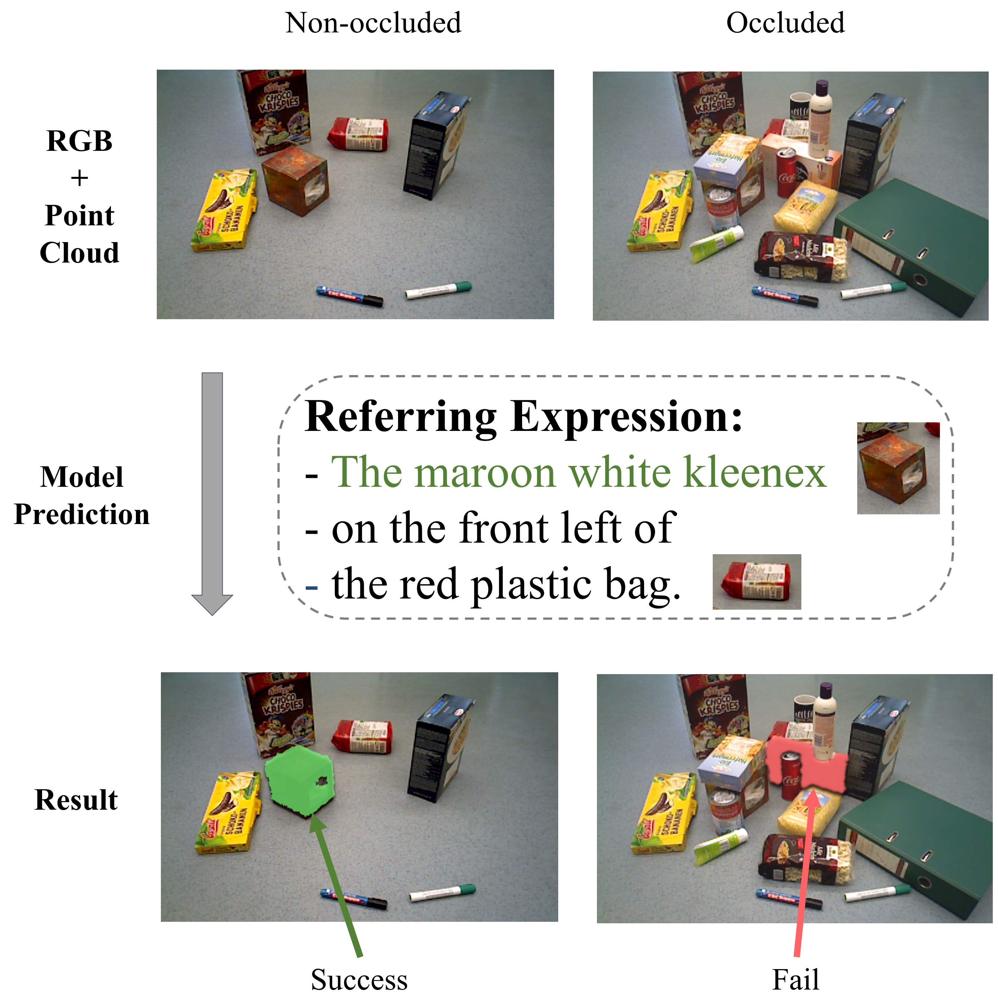

# OCID-Ref: A 3D Robotic Dataset with Embodied Language for Clutter Scene Grounding



## Introduction
To effectively apply robots in working environments and assist humans, it is essential to develop and evaluate how visual grounding (VG) can affect machine performance on occluded objects. However, current VG works are limited in working environments, such as offices and warehouses, where objects are usually occluded due to space utilization issues. In our work, we propose a novel OCID-Ref dataset featuring an referring expression segmentation task with referring expressions of occluded objects. [OCID-Ref](#dataset) consists of 305,694 referring expressions from 2,300 scenes with providing RGB image and point cloud inputs. To resolve challenging occlusion issues, we argue that it's crucial to take advantage of both 2D and 3D signals to resolve challenging occlusion issues. Our experimental results demonstrate the effectiveness of aggregating 2D and 3D signals but referring to occluded objects still remains challenging for the modern visual grounding systems.

If your have interest in our work, please see our OCID-Ref paper for further details: "[OCID-Ref: A 3D Robotic Dataset with Embodied Language for Clutter Scene Grounding](https://arxiv.org/abs/2103.07679)" by Ke-Jyun Wang, Yun-Hsuan Liu, Hung-Ting Su, Jen-Wei Wang, Yu-Siang Wang, [Winston H. Hsu](https://winstonhsu.info/), [Wen-Chin Chen](http://www.cmlab.csie.ntu.edu.tw/~wcchen/) from [National Taiwan University](https://www.ntu.edu.tw/english/)

## Dataset
#### OCID
First, you must download the fully original RGBD data from [OCID](https://www.acin.tuwien.ac.at/vision-for-robotics/software-tools/object-clutter-indoor-dataset/) to your local. (If the official link is unavailable, please use our backup [link](https://drive.google.com/drive/folders/1mR_YcmfKqV4R_E6xMt8-yDjLk10w2-fo?usp=sharing))

#### OCID-Ref
The cleaned annotations and referring expressions could download from [GDRIVE](https://drive.google.com/drive/folders/1dUKpfRiSQD7bWXtpbd9aVzgquYHtWfZv?usp=sharing).

The details of the usage of the annotations. Please follow up the instructions in [instruction.txt](./instruction.txt).

## Citation
```
@inproceedings{wang-etal-2021-ocid,
    title = "{OCID}-Ref: A 3{D} Robotic Dataset With Embodied Language For Clutter Scene Grounding",
    author = "Wang, Ke-Jyun  and
      Liu, Yun-Hsuan  and
      Su, Hung-Ting  and
      Wang, Jen-Wei  and
      Wang, Yu-Siang  and
      Hsu, Winston  and
      Chen, Wen-Chin",
    booktitle = "Proceedings of the 2021 Conference of the North American Chapter of the Association for Computational Linguistics: Human Language Technologies",
    month = jun,
    year = "2021",
    address = "Online",
    publisher = "Association for Computational Linguistics",
    url = "https://aclanthology.org/2021.naacl-main.419",
    doi = "10.18653/v1/2021.naacl-main.419",
    pages = "5333--5338"
}
```
```
@inproceedings{suchi2019easylabel,
  title={EasyLabel: a semi-automatic pixel-wise object annotation tool for creating robotic RGB-D datasets},
  author={Suchi, Markus and Patten, Timothy and Fischinger, David and Vincze, Markus},
  booktitle={2019 International Conference on Robotics and Automation (ICRA)},
  pages={6678--6684},
  year={2019},
  organization={IEEE}
}
```
## Acknowledgement
This work was supported in part by the Ministry of Science and Technology, Taiwan, under Grant MOST 110-2634-F-002-026 and Qualcomm Technologies, Inc. We benefit from NVIDIA DGX-1 AI Supercomputer and are grateful to the National Center for High-performance Computing. We also thank Yu-Kai Huang for his insightful suggestion on the figures.

## License
The dataset is licensed under MIT license (see [LICENSE](./LICENSE) for details).

